# Project Philosophy & Architecture

## Architectural Philosophy

When I started Fishinic, I made a **conscious architectural decision**: split the system into **independent services** that communicate over well-defined protocols. This decision was driven by three core principles:

### 1. Simplicity & Easy-to-Work-With

By splitting into services, each team member could work independently without stepping on each other's toes. The **Serial Bridge** talks to Arduino. The **NestJS Backend** handles business logic. The **FastAPI Predictor** runs ML models. The **Expo Mobile App** is the single client for everything.

```
┌─────────────┐     USB Serial      ┌──────────────┐
│  Arduino    │─────────────────────▶│ Serial Bridge │
│  (Sensors + │    9600 baud JSON   │ :3001         │
│  Actuators) │◀────────────────────│ Node.js       │
└─────────────┘     Relay commands   └──────┬────────┘
                                            │ REST
                                            ▼
┌─────────────────────────────────────────────────────────┐
│           NestJS Backend :3000                         │
│  ┌──────────┐  ┌──────────┐  ┌──────────────────┐ │
│  │ Sensors   │  │ Alerts   │  │ Voice + Agent    │ │
│  │ Module    │  │ Module    │  │ Module           │ │
│  └──────────┘  └──────────┘  └──────────────────┘ │
│  ┌──────────┐  ┌──────────┐  ┌──────────────────┐ │
│  │ Vision    │  │ Cron      │  │ Gateway (WebSocket)│ │
│  │ Module    │  │ Module    │  │                   │ │
│  └──────────┘  └──────────┘  └──────────────────┘ │
└─────────────────────────────────────────────────────────┘
         │                                    │
         │ REST                              │ WebSocket
         ▼                                    ▼
┌─────────────┐                        ┌──────────────┐
│ FastAPI AI   │                        │ Expo Mobile   │
│ Predictor    │                        │ App :8081     │
│ :8001       │                        │ (iOS/Android/ │
└─────────────┘                        │ Web)          │
                                     └──────────────┘
```

### 2. Service Separation Benefits

| Service | Responsibility | Why Separate? |
|---|---|---|
| **Serial Bridge** | Talks to Arduino over USB | If backend crashes, hardware keeps running |
| **NestJS Backend** | Business logic, WebSocket, REST | Single source of truth for all clients |
| **FastAPI Predictor** | ML inference | Python-native for PyTorch/Scikit-learn |
| **Expo Mobile** | All-in-one client | One app for everything — no feature fragmentation |
| **Next.js Dashboard** | Web admin interface | Desktop-optimized data analysis |

### 3. The Main Agent That Does Everything

The flagship feature is **Veronica**, an autonomous AI agent that:
- Monitors sensors 24/7 via cron jobs (every 5 minutes)
- Detects anomalies and proposes actions
- Executes approved actions automatically (`agentMode: 'auto'`)
- Sends morning health briefs at 07:01 daily

```
Cron Job (every 5 minutes)
    │
    ▼
Proactive Monitor (agent.monitor.ts)
    │
    ├── Read latest sensor data
    ├── Check against thresholds
    ├── If anomaly → trigger agent loop
    │       │
    │       ▼
    │   LLM picks tool → executes → repeats (max 6 iterations)
    │       │
    │       ▼
    │   Propose action → wait for confirmation OR auto-execute
    │
    └── Send push notification to operator
```

### 4. Dynamic Camera Source Selection Pipeline

To support diverse setups (such as using an external USB camera, built-in webcam, or Apple's Continuity Camera via iPhone), we implemented a **Dynamic Camera Source Selection Pipeline** on the remote and local bridge.

The main challenge was that host camera indices (assigned by AVFoundation/OpenCV) are volatile and can change across system reboots or device re-plugs. Firdavs resolved this by implementing stable camera tracking:
1. **Bridge Probing**: The serial-bridge (`capture.py` wrapper around OpenCV and pyobjc) probes all connected AVFoundation devices and returns a stable, unique hardware identifier (UID) for each camera, alongside its volatile index.
2. **Backend Resolution**: The NestJS `VisionService` persists the selected camera by its stable UID. Every time a snapshot or live stream is requested, the backend re-evaluates the device list and resolves the UID to the current runtime AVFoundation index, passing it to the serial-bridge.
3. **Mobile & Dashboard Integration**: The mobile `FishHealthScreen` provides a UI chip selector for all connected cameras (with a "Refresh Cameras" option) and persists the selection locally using `AsyncStorage`. The live MJPEG camera stream and vision scans automatically route through this selected camera source.

---

## NestJS MVC — Strict Adherence

I followed NestJS MVC pattern **strictly** throughout the codebase:

### DTOs (Data Transfer Objects)

Every API endpoint has a corresponding DTO with `class-validator` decorators:

```typescript
// dto/create-feed-schedule.dto.ts
export class CreateFeedScheduleDto {
  @IsString()
  @Matches(/^([01][0-9]|2[0-3]):[0-5][0-9]$/)
  time: string; // "HH:MM"

  @IsNumber()
  @Min(1)
  @Max(127)
  daysMask: number;

  @IsNumber()
  @Min(1)
  @Max(10)
  portionSec: number;
}
```

### Enums

All magic strings are replaced with Enums:

```typescript
// enums/actuator-type.enum.ts
export enum ActuatorType {
  FEEDER = 'FEEDER',
  AIR_PUMP = 'AIR_PUMP',
  LED_STRIP = 'LED_STRIP',
}

// enums/alert-severity.enum.ts
export enum AlertSeverity {
  INFO = 'INFO',
  WARNING = 'WARNING',
  CRITICAL = 'CRITICAL',
  EMERGENCY = 'EMERGENCY',
}
```

### Module Structure (Strict)

Every module follows the same structure:

```
src/modules/sensors/
├── dto/
│   ├── create-sensor-reading.dto.ts
│   └── update-sensor-thresholds.dto.ts
├── enums/
│   └── sensor-type.enum.ts
├── sensors.controller.ts
├── sensors.service.ts
├── sensors.module.ts
└── entities/
    └── sensor-reading.entity.ts
```

---

## Expo Mobile — Atomic Design

The mobile app follows **Atomic Design** strictly:

```
apps/mobile/src/components/
├── atoms/           # Button, Card, Badge, Toggle, Slider
├── molecules/       # SensorTile, AlertCard, QuickActionButton
├── organisms/       # LiveSensorGrid, AlertFeed, FishVisionCard
└── screens/        # DashboardScreen, AlertsScreen, ControlsScreen, FishHealthScreen
```

### Example: `FishVisionCard` (Organism)

```typescript
// organisms/FishVisionCard.tsx
// Displays live YOLO fish count + disease detection result
// Fetches from GET /fish/count and GET /fish/health
// Updates via sensor:update WebSocket event

export function FishVisionCard() {
  const { data: count } = useApi<FishCount>('/fish/count');
  const { data: health } = useApi<HealthReport>('/fish/health');
  
  return (
    <Card>
      <Text>Population: {count?.count ?? '--'}</Text>
      <Text>Health: {health?.diseaseClass ?? 'Unknown'}</Text>
    </Card>
  );
}
```

---

# Entity-Relationship Models

## Database Schema (15 Tables)

The system uses **15 database tables** (up from 8 in the initial design). All entities are implemented with **TypeORM** and include proper foreign key constraints.

### Entity List

| # | Entity | Table Name | Key Fields | Relationships |
|---|---|---|---|---|
| 1 | SensorReadingEntity | `sensor_readings` | readingId, sensorId, type, value, status, timestamp | None |
| 2 | AlertEntity | `alerts` | alertId, sensorId, tankId, type, severity, message, acknowledged | None |
| 3 | TankConfigEntity | `tank_config` | id=1, emergency thresholds, agentMode, pushToken | None (singleton) |
| 4 | FeedScheduleEntity | `feed_schedules` | id, time, daysMask, portionSec, enabled, lastFiredAt | None |
| 5 | LightScheduleEntity | `light_schedules` | id, onTime, offTime, brightness, color, enabled | None |
| 6 | HealthReportEntity | `health_reports` | reportId, snapshotId, scores, diseaseClass, summary | **FK → CameraSnapshot** |
| 7 | FishCountEntity | `fish_counts` | countId, snapshotId, count, confidence | **FK → CameraSnapshot** |
| 8 | FishGrowthEntity | `fish_growth` | growthId, date, avgSizeEstimate, count, deltaFromPrev | None |
| 9 | CameraSnapshotEntity | `camera_snapshots` | snapshotId, imagePath, triggeredBy | None |
| 10 | ActuatorEventEntity | `actuator_events` | id, type, state, source, reason | None |
| 11 | ChatMessageEntity | `chat_messages` | id, sessionId, role, content | None (sessionId = string) |
| 12 | UserCommandEntity | `user_commands` | commandId, actuatorId, commandType, source, payload | None |
| 13 | VoiceSessionEntity | `voice_sessions` | sessionId, snapshotId, transcribedText, aiResponse | **FK → CameraSnapshot** |
| 14 | AttitudeDetectionEntity | `attitude_detections` | id, snapshotId, swimAngle, tiltSeverity | **FK → CameraSnapshot** |
| 15 | MovementDetectionEntity | `movement_detections` | id, snapshotId, speedPx, movementType | **FK → CameraSnapshot** |

### ER Diagram (Mermaid)

```mermaid
erDiagram
    camera_snapshots ||--o{ fish_counts : "1:N"
    camera_snapshots ||--o{ health_reports : "1:N"
    camera_snapshots ||--o{ voice_sessions : "1:N"
    camera_snapshots ||--o{ attitude_detections : "1:N"
    camera_snapshots ||--o{ movement_detections : "1:N"
    
    sensor_readings {
        int readingId PK
        int sensorId
        string type
        float value
        string unit
        string status
        datetime timestamp
    }
    
    alerts {
        int alertId PK
        int sensorId
        int tankId
        string type
        string severity
        text message
        boolean acknowledged
        datetime createdAt
    }
    
    tank_config {
        int id PK
        int cleaningIntervalDays
        float emergencyTempMax
        float emergencyTempMin
        float emergencyDoMin
        float emergencyPhMin
        float emergencyPhMax
        string pushToken
        boolean pushEnabled
        string agentMode
        boolean agentMonitorEnabled
    }
    
    feed_schedules {
        int id PK
        string time
        int daysMask
        int portionSec
        boolean enabled
        datetime lastFiredAt
    }
    
    light_schedules {
        int id PK
        string onTime
        string offTime
        int brightness
        string color
        boolean enabled
    }
    
    health_reports {
        int reportId PK
        int snapshotId FK
        string phStatus
        string tempStatus
        string doStatus
        string visualStatus
        string behaviorStatus
        string behaviorLabel
        float behaviorConfidence
        float overallScore
        text summary
        string diseaseClass
        float mlConfidence
        string severity
    }
    
    fish_counts {
        int countId PK
        int snapshotId FK
        int count
        float confidence
    }
    
    fish_growth {
        int growthId PK
        string date
        float avgSizeEstimate
        int count
        float deltaFromPrev
    }
    
    camera_snapshots {
        int snapshotId PK
        string imagePath
        string triggeredBy
        datetime timestamp
    }
    
    actuator_events {
        int id PK
        string type
        boolean state
        string source
        string reason
        datetime timestamp
    }
    
    chat_messages {
        int id PK
        string sessionId
        string role
        text content
        datetime createdAt
    }
    
    user_commands {
        int commandId PK
        int actuatorId
        string commandType
        string source
        json payload
        datetime createdAt
        datetime executedAt
    }
    
    voice_sessions {
        int sessionId PK
        int snapshotId FK
        datetime wakeWordAt
        text transcribedText
        text aiResponse
        string audioOutputPath
        int durationMs
        datetime createdAt
    }
    
    attitude_detections {
        int id PK
        int snapshotId FK
        int frameIndex
        string region
        float swimAngle
        float aspectRatio
        string tiltSeverity
        float anomalyScore
        int bbox_x
        int bbox_y
        int bbox_w
        int bbox_h
    }
    
    movement_detections {
        int id PK
        int snapshotId FK
        int frameIndex
        string region
        float centroidX
        float centroidY
        float speedPx
        float directionDegrees
        float driftRatio
        string movementType
        float anomalyScore
    }
```



---

# Features Implemented

## Ismail's Contributions (Lead Architect)

### Backend Architecture

| Feature | Commit | Description |
|---|---|---|
| Monorepo setup | `f1b7bcc` | pnpm workspaces, strict version pinning |
| NestJS module system | `64d3a36` | 10 modules: sensors, alerts, actuators, vision, voice, cron, gateway, serial, management, database, push |
| TypeORM integration | `0bee212` | SQLite (dev) + PostgreSQL (prod-ready with SSL) |
| WebSocket gateway | `db21eef` | 5 events: `sensor:update`, `alert:new`, `fish:count`, `health:report`, `actuator:state` |

### Autonomous AI Agent (Flagship Feature)

| Feature | Commit | Description |
|---|---|---|
| Tool schema | `b0dacc6` | 9 tools: readSensors, readHistory, getActuatorState, readDiagnoses, readThresholds, controlPump, controlLed, triggerFeed, addSchedule |
| Agent loop | `b0dacc6` | MAX_ITERATIONS=6, LLM picks tool → executes → repeats or responds |
| Confirm-before-act UI | `c46dd5a` | Proposed action card with Confirm/Cancel buttons in FishHealthScreen |
| Proactive monitor | `b0dacc6` | 5-minute sensor watcher → push notification on detected issue |
| Morning health brief | `b0dacc6` | Cron `1 7 * * *` → Veronica overnight summary → push |
| `addSchedule` tool | `b0dacc6` | Veronica can create feed schedules via voice command |

### Mobile Application

| Feature | Commit | Description |
|---|---|---|
| 4-tab navigation | `36073f2` | Dashboard, Alerts, Controls, Fish AI |
| Live sensor data | `db21eef` | WebSocket integration, real-time updates |
| Voice overlay | `c1f6632` | Animated orb, live transcription, STT race-condition fixes |
| Glassmorphic Reasoning Terminal | `c1f6632` | macOS-style scrolling console for agent thinking visualization |
| Push notifications | `88e5e74` | `usePushToken`, `PushService`, deep linking |
| Hardware resilience | `5aa29f9` | Stale detection, offline banner, watchdog |

### Veronica Voice Assistant

| Feature | Commit | Description |
|---|---|---|
| OpenRouter cloud LLM | `a57f5e1` | Force OpenRouter over local Ollama for reliability |
| Sensor context bundling | `9bbce37` (Maral) | Live sensor data injected into LLM system prompt |
| Voice pipeline | `c1f6632` | Whisper API → LLM → Kokoro-82M TTS |

### Database & Migrations

| Feature | Commit | Description |
|---|---|---|
| 15 TypeORM entities | `c3dd5b6` | All entities with proper FK constraints |
| Supabase production config | `0bee212` | SSL support, connection pooling |
| Seed script | Pending | Default tank config + light schedule |

### DevOps & Infrastructure

| Feature | Commit | Description |
|---|---|---|
| Docker Compose | `6514871` | Skeleton for single-command deployment |
| `start_all.sh` | `b6c338d` | Automated startup with cache cleaning |
| Version pinning | `f1b7bcc` | expo~54 + RN 0.81.5 + react 19.1.0 (prevents white-screen bugs) |

---

## Maral's Contributions (Database + AI Behavior)

| Feature | Commit | Description |
|---|---|---|
| Behavior analysis pipeline | `de4f5f7` | ConvLSTM-VAE for behavioral anomaly detection |
| Behavior analysis routes | `774c1f2` | `POST /predict/behavior` endpoint in FastAPI |
| Trained behavior models | `fe44dcd` | Uploaded trained ConvLSTM-VAE weights |
| Wire behavior into Veronica | `9a3be22` | Veronica now uses behavior analysis in health reports |
| Fix mobile vision ports | `155931c` | Corrected AI Predictor port 8000 → 8001 |
| Switch Veronica to OpenRouter | `9bbce37` | Cloud LLM fallback for reliability |

---

## Firdavs' Contributions (AI Predictor)

| Feature | Commit | Description |
|---|---|---|
| FastAPI predictor service | `1fed389` | Async REST API for ML inference |
| YOLO disease detection | `1fed389` | `POST /predict/disease` endpoint |
| YOLO fish count | `1fed389` | `POST /predict/count` endpoint |
| Random Forest water quality | `1fed389` | `POST /predict/quality` endpoint |
| Chat message sanitization | `44ca07e` | Remove hidden `[Live tank]` prefix |
| Camera Source Selection | `65b6a77` | Resolved camera source selection across vision pipeline using AVFoundation UIDs |

---

## Sarvar's Contributions (Hardware)

| Feature | Commit | Description |
|---|---|---|
| Arduino firmware | `92de7cf` | pH, DO, CO₂, DS18B20, Feeder Servo, RTC |
| Serial bridge | `a6efba3` | JSON parser, bidirectional Arduino ↔ NestJS protocol |
| Automated start/stop scripts | `a6efba3` | `start_all.sh`, `stop_all.sh` |
| Cloud-first LLM support | `92de7cf` | OpenRouter with local Ollama fallback |

---

# Commit History (Chronological)

## May 2026

| Date | Commit | Author | Message |
|---|---|---|---|
| 2026-05-01 | `88e5e74` | Ismail | feat(chat): persist session across restarts + chat history drawer |
| 2026-05-01 | `b2c9f36` | Ismail | fix(chat): replace getRawMany with in-memory grouping — snake_case column bug |
| 2026-05-01 | `01a90d3` | Ismail | fix(chat): seven bugs in Veronica chat history flow |
| 2026-05-05 | `c80a2b3` | Ismail | fix(dashboard): wire Veronica to real agent endpoint + session persistence |
| 2026-05-08 | `154ffc7` | Ismail | fix(backend): remove deprecated useFcmV1 from Expo constructor |
| 2026-05-15 | `92de7cf` | Sarvar | feat: implement cloud-first LLM support via OpenRouter with local Ollama fallback |
| 2026-05-15 | `5466bb9` | Firdavs | fix(chat): strip hidden [Live tank] context prefix from rendered messages |
| 2026-05-21 | `6290214` | Ismail | feat: integrate OpenRouter cloud LLM and align health checks |
| 2026-05-21 | `c1f6632` | Ismail | feat(mobile): implement premium reasoning terminal, natural speech engine & resolve Expo Go compatibility |
| 2026-05-21 | `d71af1d` | Ismail | fix(mobile): REMOVE react-native-keyboard-controller and react-native-reanimated -- broke Expo Go |
| 2026-05-22 | `3556061` | Ismail | fix: downgrade mobile expo dependencies to match SDK 54 and fix white screen on native; run expo in foreground |
| 2026-05-22 | `a63fa67` | Ismail | feat(dashboard,ai-predictor): dashboard live data and predictor robustness |
| 2026-05-22 | `0d9ddca` | Ismail | chore: unify start scripts and fix macOS mobile white screen bug |

## June 2026

| Date | Commit | Author | Message |
|---|---|---|---|
| 2026-06-01 | `de4f5f7` | Maral | Add fish behavior analysis pipeline |
| 2026-06-01 | `fe44dcd` | Maral | Add trained behavior and disease models |
| 2026-06-05 | `b0dacc6` | Ismail | feat: remove Ollama, expand agent tools, wire critical DO auto-actions |
| 2026-06-05 | `c46dd5a` | Ismail | feat: wire movement/attitude models, live camera frame endpoint, redesign FishVisionCard |
| 2026-06-05 | `9a3be22` | Maral | feat: wire video behavior analysis into veronica |
| 2026-06-05 | `155931c` | Maral | fix: wire mobile vision and startup ports |
| 2026-06-05 | `9bbce37` | Maral | fix: switch veronica health to openrouter |
| 2026-06-06 | `c3dd5b6` | Ismail | feat(backend): add AttitudeDetection + MovementDetection entities, update health-report/voice-session schemas, improve mobile FishVision + FishHealth screens, update diagrams |
| 2026-06-12 | `65b6a77` | Firdavs | feat: camera source selection across vision pipeline |
| 2026-06-12 | `1ac9873` | Firdavs | chore: commit remaining workspace state |

---

# Lessons Learned & Technical Debt

## Critical Lessons

### 1. Version Pinning Saves Lives

**Commit:** `f1b7bcc` — "🚨 CRITICAL: DO NOT MIX EXPO SDK VERSIONS"

We learned the hard way: **never upgrade Expo SDK in the middle of a project**. Upgrading from SDK 53 to 54 caused white-screen crashes on both iOS and Android. The fix required:
- Downgrading all Expo dependencies to match SDK 54
- Pinning `expo~54`, `react-native 0.81.5`, `react 19.1.0`
- Adding metro config workaround for Windows vs. macOS

### 2. Simulated Data Is the Enemy

**Commit:** `5aa29f9` — "chore: archive dashboard — renamed to deprecated_dashboard_src"

Initially, we used simulated sensor data (`SIMULATE_SENSORS=true`). This masked hardware bugs. We switched to `SIMULATE_SENSORS=false` and fixed the serial bridge to fail loudly when hardware is disconnected.

### 3. Ollama Is Unreliable for Demos

**Commit:** `a57f5e1` — "feat(voice): force openrouter cloud LLM usage over ollama"

For the capstone demo, we can't risk Ollama crashing. We switched to **OpenRouter cloud API** (qwen2.5:3b via OpenRouter) with Ollama as fallback only.

### 4. WebSocket Events Must Be Documented

**Commit:** `db21eef` — "feat(mobile+backend): add FishVisionCard with live YOLO fish count + disease status"

We documented all 5 WebSocket events (`sensor:update`, `alert:new`, `fish:count`, `health:report`, `actuator:state`) in `docs/communication_layer.mmd`. This prevented the "mobile stopped receiving updates" bug.

---

## Remaining Technical Debt

| ID | Area | Description | Owner | Priority |
|---|---|---|---|---|
| TD-001 | Database | `synchronize: true` in TypeORM — must switch to migrations before production | Maral | High |
| TD-002 | Database | Supabase production `DATABASE_URL` not configured | Maral | High |
| TD-003 | AI Predictor | No GPU detection; no graceful missing-model handling | Firdavs | Medium |
| TD-004 | AI Predictor | ConvLSTM-VAE anomaly route not yet exposed as API endpoint | Firdavs | Medium |
| TD-005 | Dashboard | Camera, growth chart, and alerts pages not wired to backend | Maral | Low |
| TD-006 | Serial | CO₂ sensor present in hardware (A2) but not in firmware payload | Sarvar | Low |

---

# Demo Day Checklist (June 30, 2026)

## Pre-Demo Checks

- [ ] **Hardware:** Arduino connected, sensors calibrated, feeder servo tested
- [ ] **Backend:** `pnpm dev` runs without errors, all modules bootstrap
- [ ] **AI Predictor:** FastAPI running on port 8001, all 4 models loaded
- [ ] **Mobile App:** Expo Go scanning QR code, all 4 tabs functional
- [ ] **Veronica:** Voice query responds within 5 seconds, agent confirm UI appears
- [ ] **Push Notifications:** Expo push notification received on operator device
- [ ] **Documentation:** This DOCX printed, bound, and ready for submission

## Demo Script

| Time | Demo Segment | What to Show |
|---|---|---|
| 0:00–0:30 | Intro | Project overview, architecture diagram, team roles |
| 0:30–1:30 | Hardware | Arduino sensors live, pH/temp/DO readings on mobile |
| 1:30–2:30 | AI Predictor | YOLO disease detection, fish count, water quality score |
| 2:30–3:30 | Veronica Agent | Voice query, agent propose action, confirm UI, auto-execute |
| 3:30–4:30 | Mobile App | All 4 tabs, push notification, offline banner |
| 4:30–5:00 | Q&A | Technical debt, future work, lessons learned |

---

# Appendix A — Environment Variables

## `services/backend/.env`

```bash
DATABASE_URL=./fishlinic.sqlite
AI_PREDICTOR_URL=http://localhost:8001
OLLAMA_URL=http://localhost:11434
OLLAMA_MODEL=gemma4:e2b
OPENROUTER_API_KEY=<your_key_here>
SIMULATE_SENSORS=false
```

## `services/serial-bridge/.env`

```bash
SERIAL_PORT=COM3
SERIAL_PORT_SECONDARY=COM4
BAUD_RATE=9600
MOCK_MODE=false
BACKEND_URL=http://localhost:3000
```

## `apps/mobile/.env`

```bash
API_URL=http://192.168.1.100:3000
WS_URL=http://192.168.1.100:3000
EXPO_PUBLIC_PUSH_TOKEN=<expo_push_token>
```

---

# Appendix B — API Reference

## REST Endpoints (NestJS :3000)

### Sensors

| Method | Endpoint | Description |
|---|---|---|
| GET | `/sensors/latest` | Returns most recent reading for each sensor |
| GET | `/sensors/:id/readings?range=24h` | Returns history for a specific sensor |
| POST | `/serial/reading` | (Internal) Serial bridge pushes data here |

### Actuators

| Method | Endpoint | Description |
|---|---|---|
| POST | `/actuators/feed` | Triggers the automatic feeder |
| POST | `/actuators/pump` | `{ state: boolean }` — Toggles air pump |
| POST | `/actuators/led` | `{ state: boolean }` — Toggles tank lights |
| POST | `/actuators/emergency-off` | Shuts down all active actuators immediately |

### AI Predictor (Internal, NestJS → FastAPI :8001)

| Endpoint | Input | Output |
|---|---|---|
| `POST /predict/quality` | `{ pH, temp, do2, co2 }` | `{ score, status }` |
| `POST /predict/disease` | `{ imagePath }` | `{ disease, confidence, bbox }` |
| `POST /predict/count` | `{ imagePath }` | `{ count, confidence }` |
| `POST /predict/behavior` | `{ videoPath }` | `{ behaviorLabel, confidence }` |

---

# Appendix C — WebSocket Events (Socket.IO)

## Server → Client (Broadcast)

| Event | Payload Type | Trigger |
|---|---|---|
| `sensor:update` | `SensorReading` | Every 5 seconds (from backend cron + serial readings) |
| `alert:new` | `Alert` | When a sensor crosses a critical threshold |
| `fish:count` | `FishCount` | After each YOLO count inference |
| `health:report` | `FishHealthReport` | After daily AI health analysis |
| `actuator:state` | `{ type, state }` | After each actuator state change |
| `hardware:status` | `{ online: boolean }` | When Arduino connects or disconnects |

## Client → Server (Commands)

| Event | Payload | Action |
|---|---|---|
| `command:feed` | — | Trigger feeder |
| `command:pump` | `{ state: boolean }` | Toggle air pump |
| `command:led` | `{ state: boolean }` | Toggle tank LED |

---

# Acknowledgments

- **Ismail** — Lead Architect, built 90% of the codebase end-to-end
- **Maral** — Database specialist, trained behavior analysis models, wired Veronica to OpenRouter
- **Firdavs** — AI engineer, built FastAPI predictor with 4 ML models
- **Sarvar** — Hardware engineer, built Arduino firmware and serial bridge
- **Sejong University** — Provided the capstone project framework and evaluation criteria

---

*Document generated: June 6, 2026*  
*Author: Ismail (ismoiljon1101)*  
*Repository: https://github.com/ismoiljon1101/capstone_aquarium_sejong*
