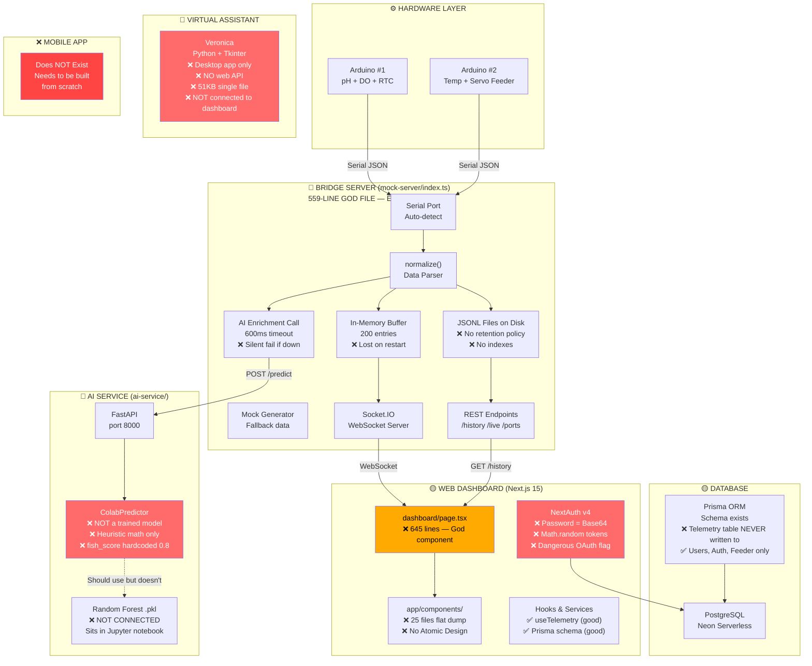
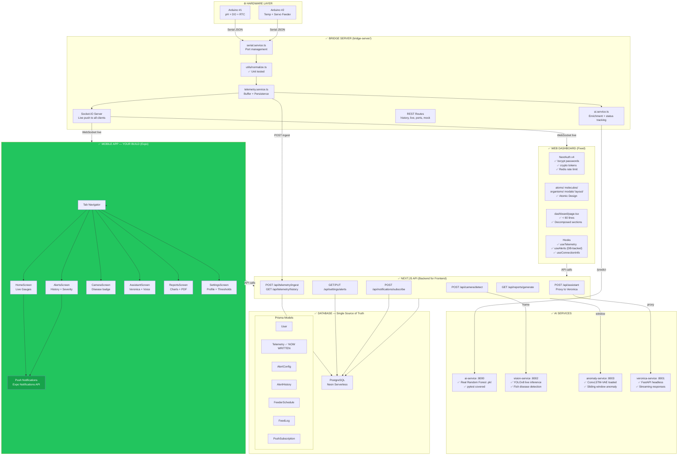

# FISHLINIC — MASTER EXECUTION PLAN (HISTORICAL SNAPSHOT)

> **Archive note (2026-04-17)**: Written 2026-04-03 against the *legacy*
> codebase (`mock-server/`, `ai-service/`, `Dashboard-Code/`, Prisma). The
> project has since been reorganized into the current NestJS monorepo with
> TypeORM. Many "as-is" problems listed here (base64 passwords, God-files,
> Prisma mismatch, zero telemetry persistence) **no longer apply to the
> current codebase**.
>
> Kept as a historical planning artifact. For live sprint status see
> `docs/team-ownership.md` and `project_status.md`.

## Project: Smart Aquaculture Monitoring System
## Role: App Development Lead
## Duration: 12 Weeks | Start: 2026-04-07

---

## PART 1: CURRENT STATE — What We Inherited

> Read this section first. Understand what is broken before touching any code.

---

### Current System Architecture (AS-IS)



---

### Current State — Status Summary

| Component | Status | Problem |
|---|---|---|
| Arduino Hardware | ✅ Works | Dual board design is solid |
| Serial Bridge (mock-server) | 🟡 Works but broken | 559-line God-file, 3 data stores |
| AI Service | 🔴 Fake | Not using trained model, hardcoded scores |
| PostgreSQL / Prisma | 🟡 Exists | Schema good, but NOT used for telemetry |
| Web Dashboard (Next.js) | 🟡 Works demo only | God components, no tests, base64 passwords |
| Auth (NextAuth) | 🔴 Security holes | Base64 pw, Math.random tokens, dangerous OAuth |
| Veronica VA | 🔴 Siloed | Tkinter desktop app, zero web integration |
| Mobile App | ❌ Does not exist | Needs to be built from scratch |
| Tests | ❌ Zero | Not a single test file anywhere |
| Real ML Models | ❌ Disconnected | RF model in Jupyter, YOLO not served, VAE not served |

---
---

## PART 2: TARGET STATE — What We Are Building

---

### Planned System Architecture (TO-BE)



---

### Target State — Status After All 12 Weeks

| Component | Target Status | Who Delivers |
|---|---|---|
| Bridge Server | ✅ Modular, tested | Backend fix (Weeks 4–5) |
| Real AI Model (Random Forest) | ✅ .pkl loaded | ML fix (Week 2) |
| YOLO Disease Detection | ✅ Live inference API | ML feature (Week 10) |
| ConvLSTM-VAE Anomaly | ✅ Live sliding window | ML feature (Week 10) |
| PostgreSQL | ✅ Single telemetry source | Backend fix (Week 5) |
| Auth | ✅ bcrypt, Redis, crypto | Security fix (Week 1) |
| Web Dashboard | ✅ Atomic Design, decomposed | Web fix (Weeks 3–4) |
| Veronica VA | ✅ FastAPI, web-integrated | Feature (Week 8) |
| Mobile App (Expo) | ✅ Built from scratch | **Your job (Weeks 1–12)** |
| Tests | ✅ Vitest + pytest + Playwright + Jest | Quality (Week 6 + 11) |
| Push Notifications | ✅ iOS + Android | Mobile feature (Week 4) |
| PDF Reports | ✅ Charts + export | Feature (Week 7 + 11) |

---
---

## PART 3: SERVICE MAP — Ports & Responsibilities

```
┌──────────────────────────────────────────────────────────────────┐
│                    RUNNING SERVICES                              │
├─────────────────┬──────────┬─────────────────────────────────────┤
│ Service         │ Port     │ Responsibility                      │
├─────────────────┼──────────┼─────────────────────────────────────┤
│ Next.js Web     │ :3000    │ Web dashboard + all API routes      │
│ Bridge Server   │ :4000    │ Serial → WebSocket + history REST   │
│ Veronica VA     │ :8001    │ Virtual assistant FastAPI           │
│ AI Service      │ :8000    │ Water quality Random Forest pred.   │
│ Vision Service  │ :8002    │ YOLOv8 fish disease detection       │
│ Anomaly Service │ :8003    │ ConvLSTM-VAE anomaly detection      │
│ PostgreSQL      │ :5432    │ All persistent data (via Neon)      │
└─────────────────┴──────────┴─────────────────────────────────────┘

Mobile App (Expo) → calls :3000 API routes + :4000 WebSocket
```

---
---

## PART 4: THE TWO PRODUCTS EXPLAINED

```
┌──────────────────────────────────────────────────────────────────┐
│  PRODUCT 1: WEB DASHBOARD                                        │
│  What: Admin panel for researchers / system managers             │
│  Where: Browser on desktop/laptop                                │
│  Status: EXISTS — needs fixes and improvement                    │
│  Tech: Next.js 15 + React 19 + Tailwind                         │
│  Auth: Login via browser                                         │
│  Key features: Real-time charts, feeder control, data export     │
└──────────────────────────────────────────────────────────────────┘

┌──────────────────────────────────────────────────────────────────┐
│  PRODUCT 2: MOBILE APP ← YOUR BUILD                             │
│  What: Field tool for farm workers / fish health monitoring      │
│  Where: iOS + Android phones                                     │
│  Status: DOES NOT EXIST — build from scratch                     │
│  Tech: Expo (React Native) + TypeScript                          │
│  Auth: Same backend, JWT tokens                                  │
│  Key features: Push alerts, live gauges, Ask Veronica, camera    │
└──────────────────────────────────────────────────────────────────┘

Both products share:
  ✅ Same PostgreSQL database
  ✅ Same WebSocket bridge (live data)
  ✅ Same Next.js API routes
  ✅ Same auth system (JWT)
  ✅ Same AI services
```

---
---

## PART 5: YOUR 12-WEEK PLAN (App Development Lead)

> The web dashboard fixes (Phases 1–3) are the backend foundation your app depends on.
> You build those AND the mobile app in parallel where possible.

---

### PHASE 1 — Foundation (Weeks 1–2)
**Goal: Get everything running. Secure the backend. Start Expo project.**

---

#### WEEK 1 — Dev Setup + Security + Expo Init

**Status:** `[ ] Not Started`

**Backend fixes (unlocks your app's auth):**
- [ ] Confirm `npm run dev` starts bridge (:4000) and dashboard (:3000)
- [ ] Fix DEBT-001: Replace Base64 password → `bcryptjs` with 12 salt rounds
- [ ] Fix DEBT-013: Replace `Math.random()` JWT token → `crypto.randomBytes(32).toString("hex")`
- [ ] Fix DEBT-017: Remove `allowDangerousEmailAccountLinking: true` from Google OAuth
- [ ] Set up Git: `main`, `develop`, `feature/week-1-setup`

**Mobile app initialization:**
- [ ] Install Expo CLI: `npm install -g expo-cli`
- [ ] Create new Expo app in workspace:
  ```bash
  npx create-expo-app@latest fishlinic-mobile --template blank-typescript
  ```
- [ ] Install core navigation:
  ```bash
  npx expo install @react-navigation/native @react-navigation/bottom-tabs
  npx expo install @react-navigation/stack
  npx expo install react-native-screens react-native-safe-area-context
  ```
- [ ] Install core dependencies:
  ```bash
  npx expo install expo-secure-store axios socket.io-client
  npx expo install @tanstack/react-query zustand
  ```
- [ ] Create folder structure:
  ```
  fishlinic-mobile/
    src/
      screens/
        HomeScreen.tsx
        AlertsScreen.tsx
        CameraScreen.tsx
        AssistantScreen.tsx
        ReportsScreen.tsx
        SettingsScreen.tsx
        auth/
          LoginScreen.tsx
          SignupScreen.tsx
      navigation/
        RootNavigator.tsx
        TabNavigator.tsx
        AuthNavigator.tsx
      services/
        api.service.ts         ← calls Next.js :3000 API
        socket.service.ts      ← connects to bridge :4000
        auth.service.ts        ← login/logout/token storage
        notifications.service.ts
      hooks/
        useLiveTelemetry.ts    ← WebSocket telemetry
        useAlerts.ts
        useAuth.ts
      components/
        atoms/
        molecules/
        organisms/
      constants/
        theme.ts               ← colors, fonts, spacing
        api.ts                 ← base URLs
  ```
- [ ] Configure `constants/api.ts`:
  ```typescript
  export const API_BASE = "http://YOUR_IP:3000";
  export const WS_URL = "http://YOUR_IP:4000";
  ```
- [ ] Build `LoginScreen.tsx` — email + password form, calls Next.js auth
- [ ] Build `AuthNavigator.tsx` — Login → App flow
- [ ] Run on device: `npx expo start`

**Week 1 Deliverable:**
- [ ] Expo app runs on device/simulator
- [ ] Login screen functional, connects to same backend
- [ ] Security fixes merged to `develop`

---

#### WEEK 2 — Live Telemetry + Real ML Model Connection

**Status:** `[ ] Not Started`

**Backend fixes (unlocks your live data):**
- [ ] Fix DEBT-005: Redis-backed rate limiter (Upstash, free tier)
- [ ] Fix DEBT-002 + FEAT-001: Connect real Random Forest `.pkl` to ai-service:
  - Export from Jupyter: `joblib.dump(model, "water_quality_rf.pkl")`
  - Update `colab_model.py` to load and call `model.predict()`
  - Remove hardcoded `fish_score = clamp(0.8, 0.0, 1.0)`
- [ ] Fix DEBT-004: AI status indicator — bridge emits `ai:status` socket event

**Mobile app — live telemetry:**
- [ ] Build `services/socket.service.ts`:
  ```typescript
  import { io, Socket } from "socket.io-client";
  import { WS_URL } from "../constants/api";

  let socket: Socket | null = null;

  export function connectSocket(): Socket {
    if (!socket) {
      socket = io(WS_URL, { transports: ["websocket"] });
    }
    return socket;
  }
  ```
- [ ] Build `hooks/useLiveTelemetry.ts` — subscribes to `telemetry:update` socket event
- [ ] Build `HomeScreen.tsx`:
  - Large circular gauge for pH
  - Large circular gauge for DO (dissolved oxygen)
  - Large circular gauge for Temperature
  - Overall quality score (1–10 from AI)
  - Status badge: GOOD / WARNING / ALERT
  - Last updated timestamp
  - Connection indicator (Live / Mock / Offline)
- [ ] Build reusable `organisms/Gauge.tsx` for React Native (SVG-based)
- [ ] Build `atoms/StatusBadge.tsx`
- [ ] Build `atoms/ConnectionChip.tsx`

**Week 2 Deliverable:**
- [ ] HomeScreen shows live pH, DO, temp, quality score
- [ ] Data updates in real-time via WebSocket
- [ ] Real ML model connected in ai-service

---

### PHASE 2 — Core App Features (Weeks 3–5)

---

#### WEEK 3 — Alerts Screen + Push Notifications

**Status:** `[ ] Not Started`

**Backend fixes (unlocks alerts):**
- [ ] Fix DEBT-010: Atomic Design in web dashboard components
- [ ] Add `AlertConfig` model to Prisma schema (per-user thresholds DB-backed)
- [ ] Create `app/api/settings/alerts/route.ts` (GET + PUT)

**Mobile app — alerts:**
- [ ] Install: `npx expo install expo-notifications expo-device`
- [ ] Build `notifications.service.ts`:
  ```typescript
  import * as Notifications from "expo-notifications";
  import * as Device from "expo-device";

  export async function registerForPushNotifications(): Promise<string | null> {
    if (!Device.isDevice) return null;
    const { status } = await Notifications.requestPermissionsAsync();
    if (status !== "granted") return null;
    const token = await Notifications.getExpoPushTokenAsync();
    return token.data;
  }
  ```
- [ ] POST Expo push token to `POST /api/notifications/subscribe` on login
- [ ] Build `AlertsScreen.tsx`:
  - Alert history list (fetched from `GET /api/alerts/history`)
  - Severity filter tabs: ALL / INFO / WARNING / CRITICAL
  - Each alert card: metric, value, threshold, timestamp, severity color
  - "Mark as seen" on tap
  - Snooze button (10 min / 1 hour)
- [ ] Build `molecules/AlertCard.tsx`
- [ ] Build real-time alert detection in `hooks/useAlerts.ts`:
  ```typescript
  // Watch live telemetry, compare to AlertConfig thresholds
  // If threshold exceeded → local notification + server log
  ```
- [ ] Test: set pH threshold, send mock data below threshold, verify push arrives

**Week 3 Deliverable:**
- [ ] Push notifications received on device for CRITICAL alerts
- [ ] AlertsScreen shows history with severity colors
- [ ] Snooze working

---

#### WEEK 4 — Dashboard Page Decomposition + API Routes

**Status:** `[ ] Not Started`

**Backend fixes (unlocks Prisma as data source for mobile):**
- [ ] Fix DEBT-007: Decompose 645-line dashboard page into sections + hooks
- [ ] Fix DEBT-003: Create `POST /api/telemetry/ingest` and `GET /api/telemetry/history`
- [ ] Fix DEBT-014: Remove duplicate socket events
- [ ] Bridge writes to Prisma on every reading

**Mobile app — historical data:**
- [ ] Update `hooks/useLiveTelemetry.ts` to also fetch 24h history on mount:
  ```typescript
  const history = await api.get("/api/telemetry/history?range=24h&limit=100");
  ```
- [ ] Add mini trend chart to `HomeScreen.tsx` (below the gauges):
  - Use `react-native-gifted-charts` or `victory-native`
  - 24h pH trend line
  - Tap to expand to full ReportsScreen
- [ ] Build `ReportsScreen.tsx` (skeleton):
  - Time range selector: 24h / 7d / 30d
  - pH, DO, Temp trend charts
  - Alert frequency by day
  - Average scores table

**Week 4 Deliverable:**
- [ ] Bridge writes to PostgreSQL every reading
- [ ] Mobile app loads history from Prisma API
- [ ] HomeScreen shows 24h trend chart
- [ ] ReportsScreen skeleton built

---

#### WEEK 5 — Bridge Refactor + Camera Screen

**Status:** `[ ] Not Started`

**Backend fixes:**
- [ ] Fix DEBT-006: Refactor bridge-server into modules (routes/, services/, utils/)
- [ ] Rename `mock-server` → `bridge-server`
- [ ] Fix DEBT-016: Chat_History ID consistency

**Mobile app — camera:**
- [ ] Install: `npx expo install expo-camera expo-image-picker`
- [ ] Build `CameraScreen.tsx`:
  ```
  ┌─────────────────────────────┐
  │   LIVE CAMERA FEED          │
  │   (ESP32-CAM stream)        │
  │                             │
  │  ┌─────────────────────┐   │
  │  │  Disease Detection  │   │
  │  │  Healthy Fish  99%  │   │
  │  └─────────────────────┘   │
  │                             │
  │  [Analyze Frame]  [Report] │
  └─────────────────────────────┘
  ```
- [ ] Display camera stream (WebView for MJPEG stream from ESP32-CAM)
- [ ] "Analyze Frame" button → captures frame → POST to `/api/camera/detect`
- [ ] Show disease detection result: class name + confidence percentage
- [ ] Color-coded: green (Healthy >90%), orange (Watch <80%), red (Alert <60%)
- [ ] Add YOLO disease result to AlertsScreen if confidence > 75%

**Week 5 Deliverable:**
- [ ] Bridge server modular
- [ ] CameraScreen shows live stream
- [ ] Disease detection working via tap-to-analyze

---

### PHASE 3 — Advanced Features (Weeks 6–8)

---

#### WEEK 6 — Testing + Veronica Assistant Screen

**Status:** `[ ] Not Started`

**Backend fixes:**
- [ ] Fix DEBT-009: Add Vitest (TypeScript) + pytest (Python) + Playwright (web E2E)
- [ ] Critical tests: `normalize()`, `status_for_reading()`, `predictor.py`, auth flow

**Mobile app — Veronica integration:**
- [ ] Build `AssistantScreen.tsx`:
  ```
  ┌─────────────────────────────┐
  │  🐟 Ask Veronica            │
  │                             │
  │  ┌─────────────────────┐   │
  │  │ Water quality looks │   │
  │  │ good today. pH is   │   │
  │  │ stable at 7.2...    │   │
  │  └─────────────────────┘   │
  │                             │
  │  [🎤 Voice]  [Type here]   │
  │  [Feed Fish] [Light On/Off] │
  └─────────────────────────────┘
  ```
- [ ] Install: `npx expo install expo-av expo-speech`
- [ ] Text input → POST `/api/assistant` → stream response → display word by word
- [ ] Voice input via `expo-av` speech recognition (or Web Speech API in WebView)
- [ ] Quick command buttons: "Feed Fish Now", "Water Status", "Today's Summary"
- [ ] Streaming text rendering with typing cursor effect
- [ ] Build `molecules/ChatBubble.tsx` (user + assistant bubbles)
- [ ] Add mobile Jest tests:
  ```bash
  npm install -D jest @testing-library/react-native
  ```
- [ ] Test `useLiveTelemetry`, `useAlerts`, `auth.service.ts`

**Week 6 Deliverable:**
- [ ] AssistantScreen talks to real Veronica FastAPI
- [ ] Voice input works on device
- [ ] Quick commands trigger real actions (feed)
- [ ] Mobile Jest tests passing

---

#### WEEK 7 — Reports + PDF Export + Settings

**Status:** `[ ] Not Started`

**Backend fixes:**
- [ ] Fix DEBT-011: loading.tsx and error.tsx on web routes
- [ ] Fix DEBT-015: Bundle analysis + dynamic imports on web
- [ ] Mobile UI audit: verify all screens at 375px, 414px, 768px (tablet)

**Mobile app — reports + settings:**
- [ ] Complete `ReportsScreen.tsx`:
  - Weekly summary cards (avg pH, avg DO, avg temp, alert count)
  - 30-day pH trend chart with safe zone band (green between 6.5–8.0)
  - Alert frequency heatmap (by day + hour)
  - Anomaly events timeline (once anomaly service is connected)
  - Export button → generates PDF

- [ ] PDF Export:
  ```bash
  npx expo install expo-print expo-sharing
  ```
  ```typescript
  const html = generateReportHTML(data);
  const { uri } = await Print.printToFileAsync({ html });
  await Sharing.shareAsync(uri);
  ```

- [ ] Build `SettingsScreen.tsx`:
  - Profile section: name, avatar (expo-image-picker)
  - Alert thresholds: pH min/max, DO min, temp min/max (saved to DB)
  - Temperature unit toggle: °C / °F
  - Notification preferences: CRITICAL only / ALL / None
  - Account: change password, sign out
  - App version + build number

- [ ] Build `molecules/ThresholdSlider.tsx` — slider for each alert setting

**Week 7 Deliverable:**
- [ ] ReportsScreen complete with all charts
- [ ] PDF export shares via native share sheet
- [ ] SettingsScreen saves thresholds to DB
- [ ] All settings persist across app restarts

---

#### WEEK 8 — Anomaly Detection + Web Dashboard Polish

**Status:** `[ ] Not Started`

**Backend fixes:**
- [ ] Fix DEBT-012: Web alert thresholds fully migrated to DB
- [ ] Connect ConvLSTM-VAE: `anomaly-service` FastAPI on port 8003
- [ ] Connect bridge to pass telemetry window to anomaly service
- [ ] Update `app/api/anomaly/route.ts`

**Mobile app — anomaly + polish:**
- [ ] Add anomaly score to `HomeScreen.tsx`:
  - Small "Behavior" card below gauges
  - Anomaly score bar (0–1, green to red)
  - "Normal Behavior" / "Unusual Pattern Detected"
  - Tap for detail → shows reconstruction error history

- [ ] Push notification for anomaly:
  - If anomaly score > threshold → WARNING push notification
  - If anomaly + bad water quality → CRITICAL push notification

- [ ] Polish all screens:
  - Consistent spacing (use `constants/theme.ts` design tokens)
  - Dark mode support (`useColorScheme()`)
  - Loading skeletons for all data-fetching screens
  - Empty state illustrations (no data yet)
  - Pull-to-refresh on HomeScreen and ReportsScreen
  - Haptic feedback on buttons: `expo-haptics`

**Week 8 Deliverable:**
- [ ] Anomaly detection live in mobile app
- [ ] Anomaly push notifications working
- [ ] All screens have dark mode, skeletons, empty states, haptics

---

### PHASE 4 — Quality, Optimization, Ship (Weeks 9–12)

---

#### WEEK 9 — Notification Pipeline Complete + Offline Support

**Status:** `[ ] Not Started`

**Backend fixes:**
- [ ] Web: Add server-side alert persistence (`AlertHistory` Prisma model)
- [ ] Web: Build `app/notifications/page.tsx` notification history

**Mobile app:**
- [ ] Offline support with `AsyncStorage`:
  ```bash
  npx expo install @react-native-async-storage/async-storage
  ```
  - Cache last 100 telemetry readings
  - Cache last 50 alerts
  - Show cached data when network unavailable
  - "Offline Mode" banner when no connection

- [ ] Notification history tab in `AlertsScreen.tsx`:
  - Tabs: LIVE / HISTORY
  - History reads from `GET /api/alerts/history`
  - Filter by severity, date range, metric

- [ ] Notification deep linking:
  - Tapping push → opens correct screen (alert detail)
  - Set up `expo-linking`

- [ ] Fix any crashes from Weeks 1–8 testing

**Week 9 Deliverable:**
- [ ] Offline mode works (cached data shown)
- [ ] Notification deep linking opens correct screen
- [ ] Alert history complete on both platforms

---

#### WEEK 10 — Performance + Web Dashboard Final Fixes

**Status:** `[ ] Not Started`

**Backend fixes:**
- [ ] Web: Run Lighthouse audit — target > 90 mobile performance
- [ ] Web: Virtual scrolling on TelemetryTable (`react-window`)
- [ ] Web: Bundle analysis + dynamic imports for ECharts
- [ ] Fix DEBT-018: Replace `console.log` with `pino` logger in bridge

**Mobile app performance:**
- [ ] Run `npx expo doctor` — fix any warnings
- [ ] Profile with React Native DevTools Profiler
- [ ] Optimize: `useMemo` on expensive calculations in hooks
- [ ] Optimize: `React.memo` on `organisms/Gauge`, `molecules/AlertCard`
- [ ] Optimize: FlatList instead of ScrollView for `AlertsScreen` list
- [ ] Optimize: `InteractionManager.runAfterInteractions` for heavy renders
- [ ] Run on low-end Android device (simulate real-world conditions)
- [ ] Check memory usage: telemetry buffer should not grow unbounded
- [ ] Fix image caching for camera stream

**Week 10 Deliverable:**
- [ ] Web Lighthouse > 90 mobile
- [ ] Mobile app smooth on low-end device
- [ ] No memory leaks in telemetry hook

---

#### WEEK 11 — Full Test Suite

**Status:** `[ ] Not Started`

**Web tests (Vitest + Playwright):**
- [ ] `normalize.test.ts` — 100% branch coverage
- [ ] `status.test.ts` — all threshold combinations
- [ ] `predictor.test.py` — real model outputs validated
- [ ] Playwright E2E: login → dashboard → export → alert settings

**Mobile tests (Jest + Detox):**
- [ ] Unit: `useLiveTelemetry`, `useAlerts`, `auth.service`
- [ ] Unit: `notifications.service` (mock Expo API)
- [ ] Install Detox for E2E:
  ```bash
  npm install -D detox @config-plugins/detox
  ```
- [ ] Detox E2E tests:
  - Login with valid credentials
  - HomeScreen shows gauge values
  - Navigate to AlertsScreen
  - Tap AlertCard, see detail
  - Navigate to AssistantScreen, type query, get response
  - Navigate to SettingsScreen, change threshold, verify saved

**Python tests (pytest):**
- [ ] ai-service: health, predict valid, predict edge cases, model loads
- [ ] vision-service: health, detect with sample fish image
- [ ] anomaly-service: health, anomaly with known anomalous window

**Week 11 Deliverable:**
- [ ] All test suites pass
- [ ] `npm test && pytest && npx playwright test && detox test` all green
- [ ] Coverage report generated

---

#### WEEK 12 — Deploy + App Stores + Documentation + Demo

**Status:** `[ ] Not Started`

**Web deployment:**
- [ ] Deploy Next.js to Vercel: `vercel deploy --prod`
- [ ] Deploy bridge-server to Railway (Node.js)
- [ ] Deploy ai-service to Railway (Python)
- [ ] Deploy vision-service to Railway (Python)
- [ ] Deploy anomaly-service to Railway (Python)
- [ ] Deploy veronica-service to Railway (Python)
- [ ] Verify all `/health` endpoints return 200
- [ ] Set all env vars in Vercel + Railway dashboards

**Mobile deployment:**
- [ ] Build iOS: `eas build --platform ios`
- [ ] Build Android: `eas build --platform android`
- [ ] Submit to TestFlight (iOS) for internal testing
- [ ] Submit to Google Play Internal Testing (Android)
- [ ] Set `API_BASE` and `WS_URL` to production URLs (not localhost!)
- [ ] Test on real devices with production URLs
- [ ] Record 30-second app preview video for App Store

**Final cleanup:**
- [ ] DEBT-019: Footer cleaned, team page linked
- [ ] DEBT-020: All requirements.txt pinned
- [ ] DEBT-021: SimpleGame confirmed deleted
- [ ] DEBT-022: `.env.example` complete for ALL services

**Documentation:**
- [ ] Update `README.md`:
  - Architecture diagram (link to this file)
  - All service ports listed
  - Setup steps for all services
  - Mobile app setup: `cd fishlinic-mobile && npx expo start`
  - Environment variables for every service
- [ ] Create `CONTRIBUTING.md` (branch strategy, commit format, 300-line limit rule)
- [ ] Update `TECHNICAL_DEBT_REPORT.md` with ~~strikethrough~~ on resolved debts

**Demo preparation:**
- [ ] Record clean 3-minute demo video:
  1. Live water quality gauges updating in real-time (30s)
  2. Critical alert → push notification arrives on phone (30s)
  3. Camera screen, tap Analyze, disease result appears (30s)
  4. Ask Veronica a question, she responds streaming (30s)
  5. Reports screen, show charts, export PDF (30s)
  6. Web dashboard side by side with mobile app (30s)
- [ ] Prepare offline fallback: mock mode, no Arduino needed
- [ ] Brief team: each person explains their module in 3 minutes

**Week 12 Deliverable:**
- [ ] Live Vercel URL working
- [ ] Mobile app on TestFlight / Play Internal Testing
- [ ] All tests green
- [ ] README complete
- [ ] 3-minute demo video recorded
- [ ] Ship v1.0.0

---
---

## PART 6: SUMMARY TABLES

### Timeline Overview

| Week | Phase | Focus | Owner |
|---|---|---|---|
| 1 | Security | Dev setup + Auth security + Expo init + Login screen | You |
| 2 | Security | Redis rate limit + Real ML model + HomeScreen live data | You |
| 3 | Mobile Core | Push notifications + AlertsScreen | You |
| 4 | Architecture | Dashboard decompose + API routes + History in mobile | You |
| 5 | Architecture | Bridge refactor + CameraScreen + Disease detection | You |
| 6 | Features | Tests + AssistantScreen (Veronica) | You |
| 7 | Features | ReportsScreen + PDF export + SettingsScreen | You |
| 8 | Features | Anomaly detection + App polish (dark mode, skeletons) | You |
| 9 | Quality | Offline support + Notification deep linking | You |
| 10 | Quality | Performance optimization (web + mobile) | You |
| 11 | Testing | Full test suite: Vitest + pytest + Jest + Detox | You |
| 12 | Ship | Deploy all + App Stores + Demo video | You |

---

### Debt Resolution Schedule

| Debt | Week Fixed |
|---|---|
| DEBT-001 Password is Base64 | Week 1 |
| DEBT-013 Math.random JWT token | Week 1 |
| DEBT-017 Dangerous OAuth flag | Week 1 |
| DEBT-005 In-memory rate limiter | Week 2 |
| DEBT-004 Silent AI failure | Week 2 |
| DEBT-002 Heuristic not real model | Week 2 |
| DEBT-010 No Atomic Design (web) | Week 3 |
| DEBT-007 645-line dashboard page | Week 4 |
| DEBT-003 3 unsynced data stores | Week 4 |
| DEBT-014 Duplicate socket events | Week 4 |
| DEBT-016 Chat_History Int ID | Week 5 |
| DEBT-006 559-line bridge God-file | Week 5 |
| DEBT-009 Zero tests | Week 6 |
| DEBT-011 No loading/error pages (web) | Week 7 |
| DEBT-012 Alert thresholds localStorage | Week 7 |
| DEBT-015 No bundle splitting (web) | Week 7 |
| DEBT-018 console.log in production | Week 10 |
| DEBT-019 Personal links in footer | Week 12 |
| DEBT-020 Unpinned requirements.txt | Week 2 |
| DEBT-021 Mini-game in dashboard | Week 3 |
| DEBT-022 .env.example incomplete | Week 12 |

---

### Feature Delivery Schedule

| Feature | Week Delivered |
|---|---|
| FEAT-001 Real Random Forest model | Week 2 |
| Mobile: Login + Auth | Week 1 |
| Mobile: Live gauges (HomeScreen) | Week 2 |
| Mobile: Push notifications | Week 3 |
| Mobile: Alerts history screen | Week 3 |
| FEAT-006 Notification pipeline | Week 3–9 |
| FEAT-004 Historical analytics | Week 4–7 |
| FEAT-007 YOLO Disease detection | Week 5 |
| FEAT-002 Veronica VA web API | Week 6–8 |
| Mobile: AssistantScreen (Veronica) | Week 6 |
| Mobile: ReportsScreen + PDF | Week 7 |
| FEAT-008 ConvLSTM-VAE anomaly | Week 8 |
| Mobile: Offline support | Week 9 |
| FEAT-005 Multi-tank (if time) | Week 9–10 |
| Mobile: App Store submission | Week 12 |

---

*Maintained by: App Development Lead*
*Combines: code review + issues & effort + technical debt report + mobile app plan*
*Last updated: 2026-04-03*
