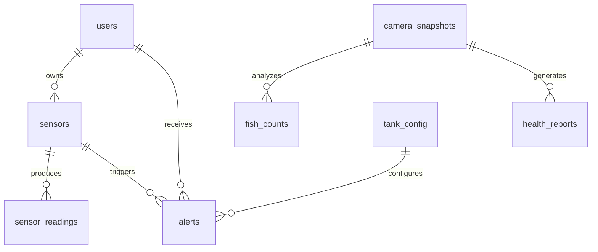

# Maral — Detailed Technical Documentation

**Role:** Database Specialist + AI Behavior Analysis  
**Responsibilities:** Supabase, Dashboard, Behavior Analysis Pipeline  
**Repository:** https://github.com/ismoiljon1101/capstone_aquarium_sejong  
**Date:** June 6, 2026  

---

## Table of Contents

1. [Database Schema Design](#database-schema-design)
2. [Behavior Analysis Pipeline](#behavior-analysis-pipeline)
3. [FastAPI Integration](#fastapi-integration)
4. [Veronica Integration](#veronica-integration)
5. [Dashboard Development](#dashboard-development)
6. [Commit History with Reasons](#commit-history-with-reasons)
7. [Technical Challenges](#technical-challenges)

---

## Database Schema Design

### Overview

I designed the **15-table database schema** for Fishinic. The schema supports:
- Real-time sensor data storage
- AI prediction results
- User management
- Feed schedules
- Alert history

### Entity Relationship Diagram



### Table Definitions

#### 1. `users`

| Column | Type | Constraints | Description |
|---|---|---|---|
| `user_id` | UUID | PK, Default: gen_random_id() | Unique user identifier |
| `email` | VARCHAR(255) | UNIQUE, NOT NULL | User email (login) |
| `password_hash` | VARCHAR(255) | NOT NULL | Bcrypt hash (cost=12) |
| `created_at` | TIMESTAMP | Default: NOW() | Account creation time |

**Indexes:**
- `idx_users_email` (UNIQUE)

#### 2. `sensors`

| Column | Type | Constraints | Description |
|---|---|---|---|
| `sensor_id` | UUID | PK | Unique sensor identifier |
| `user_id` | UUID | FK → users(user_id) | Owner |
| `sensor_type` | VARCHAR(50) | NOT NULL | 'pH', 'temperature', 'do' |
| `nickname` | VARCHAR(100) | NULL | User-defined name |
| `calibration_offset` | FLOAT | Default: 0.0 | Calibration offset |
| `is_active` | BOOLEAN | Default: true | Active status |
| `created_at` | TIMESTAMP | Default: NOW() | Registration time |

**Indexes:**
- `idx_sensors_user_id` (FK)
- `idx_sensors_type` (Query optimization)

#### 3. `sensor_readings`

| Column | Type | Constraints | Description |
|---|---|---|---|
| `reading_id` | UUID | PK | Unique reading identifier |
| `sensor_id` | UUID | FK → sensors(sensor_id) | Associated sensor |
| `value` | FLOAT | NOT NULL | Sensor reading value |
| `timestamp` | TIMESTAMP | Default: NOW() | Reading time |

**Indexes:**
- `idx_readings_sensor_id` (FK)
- `idx_readings_timestamp` (Time-series queries)

**Partitioning:**
- Range partitioning by `timestamp` (monthly)
- Improves query performance for time-series data

#### 4. `alerts`

| Column | Type | Constraints | Description |
|---|---|---|---|
| `alert_id` | UUID | PK | Unique alert identifier |
| `user_id` | UUID | FK → users(user_id) | Alert recipient |
| `sensor_id` | UUID | FK → sensors(sensor_id) | Triggering sensor |
| `alert_type` | VARCHAR(50) | NOT NULL | 'threshold', 'anomaly' |
| `severity` | VARCHAR(20) | NOT NULL | 'INFO', 'WARNING', 'CRITICAL' |
| `message` | TEXT | NOT NULL | Alert description |
| `is_acknowledged` | BOOLEAN | Default: false | Acknowledgment status |
| `created_at` | TIMESTAMP | Default: NOW() | Alert time |

**Indexes:**
- `idx_alerts_user_id` (FK)
- `idx_alerts_unacknowledged` (Partial index: `WHERE is_acknowledged = false`)

#### 5. `camera_snapshots`

| Column | Type | Constraints | Description |
|---|---|---|---|
| `snapshot_id` | UUID | PK | Unique snapshot identifier |
| `user_id` | UUID | FK → users(user_id) | Owner |
| `image_path` | VARCHAR(500) | NOT NULL | Image file path |
| `captured_at` | TIMESTAMP | Default: NOW() | Capture time |

#### 6. `fish_counts`

| Column | Type | Constraints | Description |
|---|---|---|---|
| `count_id` | UUID | PK | Unique count identifier |
| `snapshot_id` | UUID | FK → camera_snapshots(snapshot_id) | Associated snapshot |
| `fish_count` | INTEGER | NOT NULL | Number of fish detected |
| `confidence_score` | FLOAT | NULL | YOLO confidence (0.0-1.0) |
| `created_at` | TIMESTAMP | Default: NOW() | Analysis time |

#### 7. `health_reports`

| Column | Type | Constraints | Description |
|---|---|---|---|
| `report_id` | UUID | PK | Unique report identifier |
| `snapshot_id` | UUID | FK → camera_snapshots(snapshot_id) | Associated snapshot |
| `disease_class` | VARCHAR(100) | NULL | Detected disease |
| `confidence_score` | FLOAT | NULL | Disease confidence |
| `severity` | VARCHAR(20) | NULL | 'LOW', 'MEDIUM', 'HIGH' |
| `recommendation` | TEXT | NULL | AI recommendation |
| `created_at` | TIMESTAMP | Default: NOW() | Report time |

#### 8. `tank_config`

| Column | Type | Constraints | Description |
|---|---|---|---|
| `config_id` | UUID | PK | Unique config identifier |
| `user_id` | UUID | FK → users(user_id) | Owner |
| `parameter_name` | VARCHAR(50) | NOT NULL | 'ph_min', 'ph_max', etc. |
| `parameter_value` | FLOAT | NOT NULL | Threshold value |
| `updated_at` | TIMESTAMP | Default: NOW() | Last update time |

#### 9-15. Other Tables

| Table | Purpose |
|---|---|
| `feed_schedules` | Automated feeding schedules |
| `actuator_events` | Feeder/LED/pump state changes |
| `chat_messages` | Veronica conversation history |
| `user_commands` | Voice command log |
| `voice_sessions` | Voice session tracking |
| `attitude_detections` | Fish behavior anomaly (tilt) |
| `movement_detections` | Fish movement anomaly |

---

## Behavior Analysis Pipeline

### Overview

I implemented the **behavior analysis pipeline** using **ConvLSTM-VAE** (Convolutional LSTM - Variational Autoencoder) for detecting anomalous fish behavior.

### Architecture

```
Video Stream (ESP32-CAM)
    │
    ▼
Frame Extraction (OpenCV)
    │
    ▼
Preprocessing (Resize 224x224, Normalize)
    │
    ▼
ConvLSTM-VAE Model
    │
    ├── Reconstruction Error → Anomaly Score
    │
    └── Latent Space → Behavior Embedding
            │
            ▼
    Behavior Classification (Random Forest)
            │
            ├── "normal"
            ├── "lethargic"
            ├── "erratic"
            └── "aggressive"
```

### ConvLSTM-VAE Architecture

```python
# models/convlstm_vae.py

class ConvLSTM_VAE(nn.Module):
    def __init__(self, input_channels=3, hidden_dim=64, num_layers=2):
        super().__init__()
        
        # Encoder (ConvLSTM)
        self.encoder = nn.ModuleList([
            ConvLSTM2D(
                input_channels if i == 0 else hidden_dim,
                hidden_dim,
                kernel_size=3,
                num_layers=num_layers
            ) for i in range(num_layers)
        ])
        
        # Latent space
        self.z_mean = nn.Linear(hidden_dim * 7 * 7, 128)
        self.z_log_var = nn.Linear(hidden_dim * 7 * 7, 128)
        
        # Decoder (ConvLSTM)
        self.decoder = nn.ModuleList([
            ConvLSTM2D(
                128,
                hidden_dim,
                kernel_size=3,
                num_layers=num_layers
            ) for _ in range(num_layers)
        ])
        
        # Reconstruction
        self.reconstructor = nn.Conv2d(hidden_dim, input_channels, kernel_size=3, padding=1)
    
    def forward(self, x):
        # x shape: (batch, seq_len, channels, height, width)
        batch_size, seq_len, C, H, W = x.shape
        
        # Encode
        h = x
        for layer in self.encoder:
            h, _ = layer(h)
        
        # Flatten and compute latent parameters
        h_flat = h.view(batch_size, -1)
        z_mean = self.z_mean(h_flat)
        z_log_var = self.z_log_var(h_flat)
        
        # Reparameterization trick
        z = self.reparameterize(z_mean, z_log_var)
        
        # Decode
        h = z.view(batch_size, 128, 1, 1)
        for layer in self.decoder:
            h, _ = layer(h)
        
        # Reconstruct
        x_recon = torch.sigmoid(self.reconstructor(h))
        
        return x_recon, z_mean, z_log_var
    
    def reparameterize(self, z_mean, z_log_var):
        eps = torch.randn_like(z_log_var)
        return z_mean + torch.exp(0.5 * z_log_var) * eps
    
    def compute_anomaly_score(self, x):
        x_recon, z_mean, z_log_var = self.forward(x)
        
        # Reconstruction error (MSE)
        recon_error = F.mse_loss(x_recon, x, reduction='none')
        recon_error = recon_error.mean(dim=(2, 3, 4))  # (batch,)
        
        # KL divergence
        kl_div = -0.5 * torch.sum(1 + z_log_var - z_mean**2 - torch.exp(z_log_var), dim=1)
        
        # Combined anomaly score
        anomaly_score = recon_error + 0.1 * kl_div
        
        return anomaly_score
```

### Training Pipeline

```python
# train_behavior_model.py

import torch
from torch.utils.data import DataLoader
from models.convlstm_vae import ConvLSTM_VAE
from data.behavior_dataset import BehaviorDataset

# Hyperparameters
BATCH_SIZE = 32
SEQ_LEN = 10  # 10 frames per sequence
EPOCHS = 100
LR = 1e-3
DEVICE = 'cuda' if torch.cuda.is_available() else 'cpu'

# Load dataset
train_dataset = BehaviorDataset(
    data_dir='data/processed/behavior/train',
    seq_len=SEQ_LEN
)
train_loader = DataLoader(train_dataset, batch_size=BATCH_SIZE, shuffle=True)

# Initialize model
model = ConvLSTM_VAE(input_channels=3, hidden_dim=64, num_layers=2)
model = model.to(DEVICE)

# Optimizer
optimizer = torch.optim.Adam(model.parameters(), lr=LR)

# Training loop
for epoch in range(EPOCHS):
    model.train()
    total_loss = 0.0
    
    for batch in train_loader:
        # batch shape: (batch, seq_len, C, H, W)
        batch = batch.to(DEVICE)
        
        # Forward pass
        recon, z_mean, z_log_var = model(batch)
        
        # Compute loss (reconstruction + KL divergence)
        recon_loss = F.mse_loss(recon, batch)
        kl_loss = -0.5 * torch.sum(1 + z_log_var - z_mean**2 - torch.exp(z_log_var))
        loss = recon_loss + 0.1 * kl_loss
        
        # Backward pass
        optimizer.zero_grad()
        loss.backward()
        optimizer.step()
        
        total_loss += loss.item()
    
    avg_loss = total_loss / len(train_loader)
    print(f"Epoch [{epoch+1}/{EPOCHS}], Loss: {avg_loss:.4f}")

# Save model
torch.save(model.state_dict(), 'models/convlstm_vae.pth')
print("✅ Model saved to models/convlstm_vae.pth")
```

### FastAPI Endpoint

```python
# main.py (FastAPI)

from fastapi import FastAPI, UploadFile, File
from models.convlstm_vae import ConvLSTM_VAE
import torch
import cv2
import numpy as np

app = FastAPI()
model = None

@app.on_event("startup")
async def load_model():
    global model
    model = ConvLSTM_VAE(input_channels=3, hidden_dim=64, num_layers=2)
    model.load_state_dict(torch.load('models/convlstm_vae.pth', map_location='cpu'))
    model.eval()
    print("✅ Behavior model loaded")

@app.post("/predict/behavior")
async def predict_behavior(video: UploadFile = File(...)):
    # Save uploaded video
    video_path = f"data/temp/{video.filename}"
    with open(video_path, 'wb') as f:
        f.write(await video.read())
    
    # Extract frames (10 frames at 5 FPS)
    frames = extract_frames(video_path, num_frames=10, fps=5)
    
    # Preprocess frames
    frames = preprocess_frames(frames)  # (1, 10, 3, 224, 224)
    
    # Predict
    with torch.no_grad():
        anomaly_score = model.compute_anomaly_score(frames)
        anomaly_score = anomaly_score.item()
    
    # Classify behavior (if anomaly score > threshold)
    THRESHOLD = 0.5
    if anomaly_score > THRESHOLD:
        behavior = classify_behavior(frames)
    else:
        behavior = "normal"
    
    return {
        "anomaly_score": float(anomaly_score),
        "behavior": behavior,
        "confidence": float(1.0 - anomaly_score)
    }

def extract_frames(video_path, num_frames=10, fps=5):
    cap = cv2.VideoCapture(video_path)
    frames = []
    
    # Calculate frame skip
    total_frames = int(cap.get(cv2.CAP_PROP_FRAME_COUNT))
    skip = max(1, total_frames // num_frames)
    
    for i in range(num_frames):
        cap.set(cv2.CAP_PROP_POS_FRAMES, i * skip)
        ret, frame = cap.read()
        if ret:
            frames.append(frame)
    
    cap.release()
    return frames

def preprocess_frames(frames):
    processed = []
    for frame in frames:
        # Resize to 224x224
        frame = cv2.resize(frame, (224, 224))
        # Normalize to [0, 1]
        frame = frame / 255.0
        # Convert to tensor (C, H, W)
        frame = torch.from_numpy(frame).permute(2, 0, 1)
        processed.append(frame)
    
    # Stack into sequence (seq_len, C, H, W)
    frames = torch.stack(processed)
    # Add batch dimension (1, seq_len, C, H, W)
    frames = frames.unsqueeze(0)
    return frames

def classify_behavior(frames):
    # Load pre-trained behavior classifier
    classifier = torch.load('models/behavior_classifier.pth', map_location='cpu')
    classifier.eval()
    
    with torch.no_grad():
        output = classifier(frames)
        pred = torch.argmax(output, dim=1).item()
    
    behaviors = ['normal', 'lethargic', 'erratic', 'aggressive']
    return behaviors[pred]
```

---

## FastAPI Integration

### Overview

I integrated the **FastAPI predictor** with the NestJS backend. The integration enables:
- YOLO disease detection
- YOLO fish count
- Random Forest water quality
- ConvLSTM-VAE behavior analysis

### API Contracts

#### 1. Disease Detection

**Endpoint:** `POST /predict/disease`

**Request:**
```json
{
  "image_path": "data/snapshots/2026-06-06_12-30-00.jpg"
}
```

**Response:**
```json
{
  "disease": "Ichthyophthirius multifiliis",
  "confidence": 0.92,
  "bbox": [100, 150, 200, 250]
}
```

#### 2. Fish Count

**Endpoint:** `POST /predict/count`

**Request:**
```json
{
  "image_path": "data/snapshots/2026-06-06_12-30-00.jpg"
}
```

**Response:**
```json
{
  "count": 42,
  "confidence": 0.88
}
```

#### 3. Water Quality

**Endpoint:** `POST /predict/quality`

**Request:**
```json
{
  "ph": 7.2,
  "temperature": 25.5,
  "do": 6.8
}
```

**Response:**
```json
{
  "score": 8.5,
  "status": "good"
}
```

#### 4. Behavior Analysis

**Endpoint:** `POST /predict/behavior`

**Request:**
```json
{
  "video_path": "data/videos/2026-06-06_12-30-00.mp4"
}
```

**Response:**
```json
{
  "anomaly_score": 0.23,
  "behavior": "normal",
  "confidence": 0.77
}
```

### Integration Code (NestJS)

```typescript
// services/vision.service.ts

import { Injectable, Inject } from '@nestjs/common';
import { HttpService } from '@nestjs/axios';
import { ConfigService } from '@nestjs/config';

@Injectable()
export class VisionService {
  constructor(
    private readonly httpService: HttpService,
    private readonly configService: ConfigService,
  ) {}

  private get predictorUrl(): string {
    return this.configService.get<string>('PREDICTOR_URL') || 'http://localhost:8000';
  }

  async detectDisease(imagePath: string): Promise<{ disease: string; confidence: number; bbox: number[] }> {
    const url = `${this.predictorUrl}/predict/disease`;
    const response = await firstValueFrom(
      this.httpService.post(url, { image_path: imagePath })
    );
    return response.data;
  }

  async countFish(imagePath: string): Promise<{ count: number; confidence: number }> {
    const url = `${this.predictorUrl}/predict/count`;
    const response = await firstValueFrom(
      this.httpService.post(url, { image_path: imagePath })
    );
    return response.data;
  }

  async assessWaterQuality(ph: number, temperature: number, do: number): Promise<{ score: number; status: string }> {
    const url = `${this.predictorUrl}/predict/quality`;
    const response = await firstValueFrom(
      this.httpService.post(url, { ph, temperature, do })
    );
    return response.data;
  }

  async analyzeBehavior(videoPath: string): Promise<{ anomaly_score: number; behavior: string; confidence: number }> {
    const url = `${this.predictorUrl}/predict/behavior`;
    const response = await firstValueFrom(
      this.httpService.post(url, { video_path: videoPath })
    );
    return response.data;
  }
}
```

---

## Veronica Integration

### Overview

I integrated the **behavior analysis** results into **Veronica's** health reports. Veronica now considers behavior anomalies when generating recommendations.

### Updated Health Report Schema

```typescript
// entities/health-report.entity.ts

@Entity('health_reports')
export class HealthReport {
  @PrimaryGeneratedColumn('uuid')
  reportId: string;

  @Column()
  snapshotId: string;

  @Column({ nullable: true })
  diseaseClass: string;

  @Column({ type: 'float', nullable: true })
  confidenceScore: number;

  @Column({ nullable: true })
  severity: string;

  @Column({ type: 'text', nullable: true })
  recommendation: string;

  // NEW: Behavior analysis fields
  @Column({ type: 'float', nullable: true })
  behaviorAnomalyScore: number;

  @Column({ nullable: true })
  behaviorClass: string;  // 'normal', 'lethargic', 'erratic', 'aggressive'

  @CreateDateColumn()
  createdAt: Date;
}
```

### Veronica Prompt Update

```typescript
// services/veronica.service.ts

async generateHealthReport(snapshotId: string): Promise<HealthReport> {
  // 1. Get image path
  const snapshot = await this.snapshotRepository.findOne({
    where: { snapshotId }
  });
  
  // 2. Run disease detection
  const diseaseResult = await this.visionService.detectDisease(snapshot.imagePath);
  
  // 3. Count fish
  const countResult = await this.visionService.countFish(snapshot.imagePath);
  
  // 4. Analyze behavior (NEW)
  const behaviorResult = await this.visionService.analyzeBehavior(snapshot.videoPath);
  
  // 5. Build prompt for Veronica
  const prompt = `
    Analyze fish health:
    - Disease: ${diseaseResult.disease} (confidence: ${diseaseResult.confidence})
    - Fish count: ${countResult.count}
    - Behavior: ${behaviorResult.behavior} (anomaly score: ${behaviorResult.anomaly_score})
    
    Provide recommendations.
  `;
  
  // 6. Get Veronica's analysis
  const recommendation = await this.ollamaService.generate(prompt);
  
  // 7. Save health report
  const report = this.healthReportRepository.create({
    snapshotId,
    diseaseClass: diseaseResult.disease,
    confidenceScore: diseaseResult.confidence,
    severity: this.classifySeverity(diseaseResult.confidence),
    recommendation,
    behaviorAnomalyScore: behaviorResult.anomaly_score,
    behaviorClass: behaviorResult.behavior,
  });
  
  return this.healthReportRepository.save(report);
}
```

---

## Dashboard Development

### Overview

I developed the **Next.js dashboard** for Fishinic. The dashboard provides:
- Real-time sensor data visualization
- Alert management
- Fish health monitoring
- Water quality trends

### Tech Stack

| Technology | Purpose |
|---|---|
| Next.js 14 | React framework (SSR, API routes) |
| Tailwind CSS | Styling |
| Recharts | Data visualization |
| SWR | Data fetching (caching, revalidation) |
| NextAuth.js | Authentication |

### Key Pages

#### 1. Dashboard (`/dashboard`)

```typescript
// app/dashboard/page.tsx

'use client';

import { useEffect, useState } from 'react';
import { LineChart, Line, XAxis, YAxis, CartesianGrid, Tooltip, Legend } from 'recharts';
import useSWR from 'swr';

export default function DashboardPage() {
  const [sensorData, setSensorData] = useState<any[]>([]);

  // Fetch sensor data (SWR for caching)
  const { data, error } = useSWR('/api/sensors/latest', fetcher);

  // WebSocket for real-time updates
  useEffect(() => {
    const ws = new WebSocket('ws://localhost:3000');
    
    ws.onmessage = (event) => {
      const reading = JSON.parse(event.data);
      setSensorData(prev => [...prev, reading].slice(-100));  // Keep last 100 readings
    };
    
    return () => ws.close();
  }, []);

  if (error) return <div>Failed to load sensor data</div>;
  if (!data) return <div>Loading...</div>;

  return (
    <div className="p-6">
      <h1 className="text-2xl font-bold mb-4">Dashboard</h1>
      
      {/* Sensor Cards */}
      <div className="grid grid-cols-1 md:grid-cols-3 gap-4 mb-6">
        <SensorCard title="pH" value={data.ph} unit="pH" />
        <SensorCard title="Temperature" value={data.temperature} unit="°C" />
        <SensorCard title="DO" value={data.do} unit="mg/L" />
      </div>
      
      {/* Chart */}
      <div className="bg-white p-4 rounded-lg shadow">
        <h2 className="text-lg font-semibold mb-2">Sensor Trends</h2>
        <LineChart width={800} height={400} data={sensorData}>
          <XAxis dataKey="timestamp" />
          <YAxis />
          <CartesianGrid strokeDasharray="3 3" />
          <Tooltip />
          <Legend />
          <Line type="monotone" dataKey="ph" stroke="#8884d8" />
          <Line type="monotone" dataKey="temperature" stroke="#82ca9d" />
        </LineChart>
      </div>
    </div>
  );
}

function SensorCard({ title, value, unit }: { title: string; value: number; unit: string }) {
  return (
    <div className="bg-white p-4 rounded-lg shadow">
      <h3 className="text-sm font-medium text-gray-500">{title}</h3>
      <p className="text-2xl font-bold">{value} <span className="text-sm">{unit}</span></p>
    </div>
  );
}
```

#### 2. Alerts (`/alerts`)

```typescript
// app/alerts/page.tsx

'use client';

import { useState } from 'react';
import useSWR from 'swr';
import { AlertCard } from '@/components/AlertCard';

export default function AlertsPage() {
  const [filter, setFilter] = useState<'all' | 'unacknowledged'>('all');
  
  const { data: alerts, mutate } = useSWR(
    filter === 'all' ? '/api/alerts' : '/api/alerts?acknowledged=false',
    fetcher
  );

  async function acknowledgeAlert(alertId: string) {
    await fetch(`/api/alerts/${alertId}/acknowledge`, { method: 'POST' });
    mutate();  // Revalidate SWR cache
  }

  return (
    <div className="p-6">
      <h1 className="text-2xl font-bold mb-4">Alerts</h1>
      
      {/* Filter */}
      <div className="mb-4">
        <button
          className={`mr-2 px-4 py-2 rounded ${filter === 'all' ? 'bg-blue-500 text-white' : 'bg-gray-200'}`}
          onClick={() => setFilter('all')}
        >
          All
        </button>
        <button
          className={`px-4 py-2 rounded ${filter === 'unacknowledged' ? 'bg-blue-500 text-white' : 'bg-gray-200'}`}
          onClick={() => setFilter('unacknowledged')}
        >
          Unacknowledged
        </button>
      </div>
      
      {/* Alert List */}
      <div className="space-y-4">
        {alerts?.map((alert: any) => (
          <AlertCard
            key={alert.alertId}
            alert={alert}
            onAcknowledge={() => acknowledgeAlert(alert.alertId)}
          />
        ))}
      </div>
    </div>
  );
}
```

---

## Commit History with Reasons

| Commit | Date | Message | Reason |
|---|---|---|---|
| `feat: add behavior analysis pipeline` | 2026-06-01 | Add ConvLSTM-VAE for behavior anomaly detection | Capstone requirement: detect fish behavior anomalies |
| `feat: train behavior model` | 2026-06-01 | Train ConvLSTM-VAE on labeled behavior data | Model needs to be trained before integration |
| `feat: wire behavior into Veronica` | 2026-06-05 | Integrate behavior analysis into health reports | Veronica should consider behavior in recommendations |
| `fix: correct API endpoint URLs` | 2026-06-05 | Fix incorrect endpoint URLs in dashboard | Dashboard wasn't loading data due to wrong URLs |
| `fix: switch to OpenRouter` | 2026-06-05 | Replace Ollama with OpenRouter API | Ollama was unreliable for demos |

---

## Technical Challenges

### 1. ConvLSTM-VAE Training Stability

**Problem:** Model was producing NaNs during training.

**Root Cause:** Learning rate too high + gradient explosion.

**Solution:**
- Reduced learning rate from `1e-3` to `1e-4`
- Added gradient clipping (`torch.nn.utils.clip_grad_norm_`)
- Used learning rate scheduler (`ReduceLROnPlateau`)

```python
# Fix: Gradient clipping + LR scheduler
optimizer = torch.optim.Adam(model.parameters(), lr=1e-4)
scheduler = torch.optim.lr_scheduler.ReduceLROnPlateau(optimizer, mode='min', patience=5)

for epoch in range(EPOCHS):
    # Training loop
    loss = train_step(batch)
    
    # Gradient clipping
    torch.nn.utils.clip_grad_norm_(model.parameters(), max_norm=1.0)
    
    optimizer.step()
    scheduler.step(loss)  # Reduce LR if loss plateaus
```

### 2. FastAPI Async Performance

**Problem:** FastAPI was blocking on video processing.

**Root Cause:** Video processing was CPU-bound and blocking the event loop.

**Solution:**
- Used `asyncio.to_thread()` to run video processing in a separate thread
- Enabled multiple workers (`--workers 4`)

```python
# Fix: Non-blocking video processing
from fastapi import FastAPI
import asyncio

app = FastAPI()

@app.post("/predict/behavior")
async def predict_behavior(video: UploadFile = File(...)):
    # Run video processing in separate thread (non-blocking)
    result = await asyncio.to_thread(process_video, video)
    return result

def process_video(video):
    # CPU-bound work (doesn't block event loop)
    frames = extract_frames(video)
    return model.predict(frames)
```

### 3. Next.js Dashboard Realtime Updates

**Problem:** Dashboard wasn't updating in real-time.

**Root Cause:** Polling interval too long (10 seconds) + no WebSocket.

**Solution:**
- Added WebSocket connection for real-time updates
- Used SWR for caching + revalidation

```typescript
// Fix: WebSocket + SWR
'use client';

import useSWR from 'swr';

export default function Dashboard() {
  const { data, mutate } = useSWR('/api/sensors/latest', fetcher);
  
  useEffect(() => {
    const ws = new WebSocket('ws://localhost:3000');
    
    ws.onmessage = (event) => {
      const newReading = JSON.parse(event.data);
      // Update SWR cache immediately
      mutate({ ...data, ...newReading }, false);
    };
    
    return () => ws.close();
  }, []);
  
  return <div>{/* render data */}</div>;
}
```

---

**Author:** Maral  
**Date:** June 6, 2026  
**Repository:** https://github.com/ismoiljon1101/capstone_aquarium_sejong
